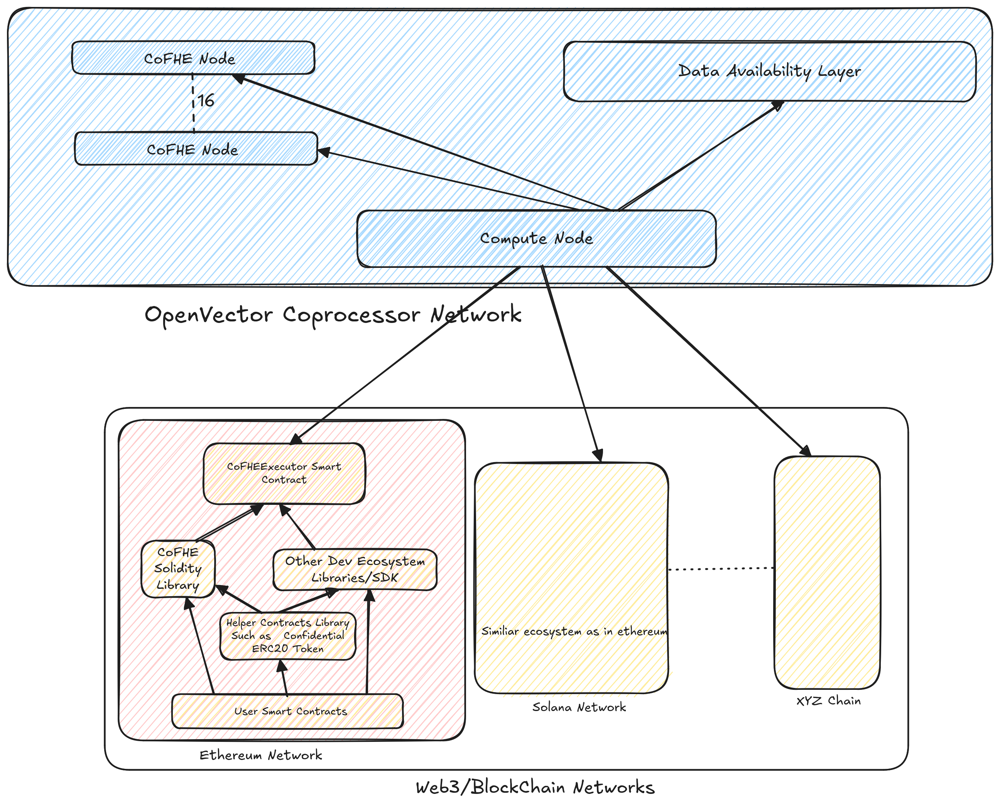

# Architecture

There are 2 main components in the OpenVector Coprocessor network:
1. **Backend**: The backend provides the core environment for confidential computing, it interacts with the OpenVector network to facilitate the same. The backend have following components:
   - **Core-Service**: The core service is the main component of the backend, it is responsible for interacting with the OpenVector network and doing the actual computation.
   - **Relay-Service**: The relay service is responsible for relaying the requests from different client networks to the Core-Service. It is also responsible for relaying the responses from the Core-Service to the client networks. For now we support Ethreum compatible networks and plan on adding Solana soon. This service is also responsible for managing the payment related to the computation.
   - **Data-Availability Layer**: The data availability layer is responsible for storing the data that is being processed by the Core-Service. For now we use local storage but will be adding support for decentralized storage solutions soon.

2. **Frontend**: The frontend is the client side of the OpenVector Coprocessor network. It consists of a libraries and SDKs for different client networks. For now we support Ethereum and provide a solidity library to interact with the OpenVector Coprocessor network and do confidential computing. There's also an example provided on how to make a Confidential token using the library. To see how to use the library please refer the NATSPEC comments in the library.

